# 🚿🚗 CarWash - Mobil Oto Yıkama Rezervasyon Sistemi

**CarWash Uygulaması ile**, işletmeler **randevu karmaşasına** son verir, tüm müşteri akışını **dijital ortamda dinamik olarak** yönetir, doluluk oranlarını optimize ederek **verimliliği artırır** ve böylece müşterilerine **daha hızlı ve düzenli** bir hizmet sunar.

---
## 🚀 **Öne Çıkan Özellikler** 🔥

- **📊 Geçmiş İşlem Veri Analizi**: Tüm eski rezervasyon ve hizmet kayıtlarını, fiyat değişimlerini ve ücret detaylarını **güvenli bir şekilde depolar**.
   
- **🗺️ Konum Bazlı Hızlı Yönlendirme**: Müşteri adresine uygulamadan kayıtlı adresi çekerek **hızlı bir şekilde navigasyon ile yönlendirmeyi sağlar**.

- **📞 Tek Tık ile Arama**: Müşteri ile iletişime geçmek için uygulamada **randevu oluştururken kaydedilmiş telefon numarasını tek tık ile aramayı sağlar**.

- **🔎 Hızlı Kayıt Erişimi**: Uygulama içindeki gelişmiş arama çubuğu sayesinde, geçmişte oluşturduğunuz tüm randevular, hizmet detayları ve işlemler arasından **istediğiniz kaydı saniyeler içinde kolayca bulun**. 

  
---

## 📸 **Uygulama Ekran Görüntüleri** 🎨

### 🔑 Ana Menü ve Arşiv Ekranı 🗄️

  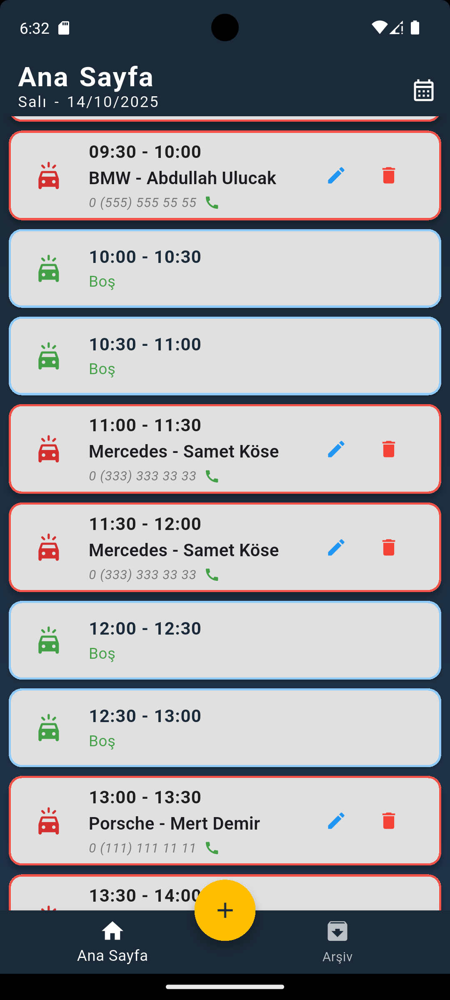
  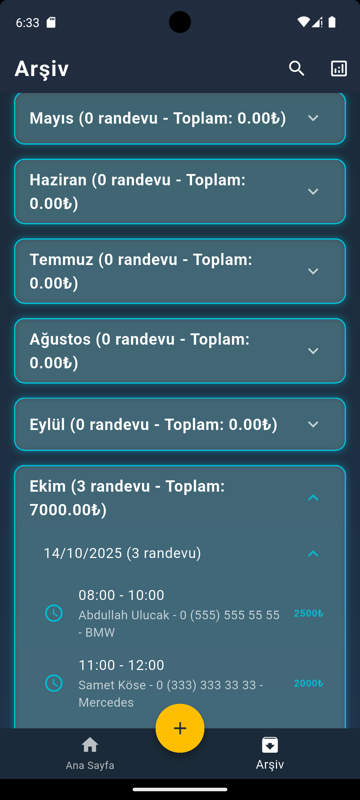
  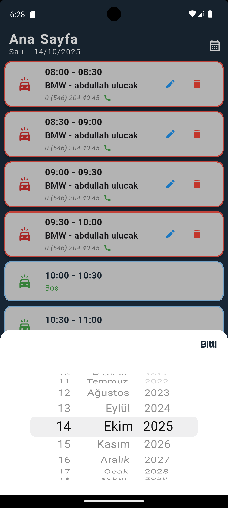

### 🗓️ Randevu Oluşturma Ekranı 📝

  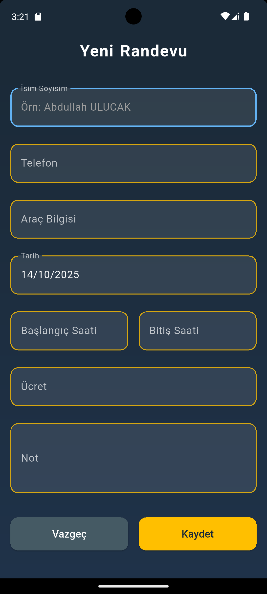
  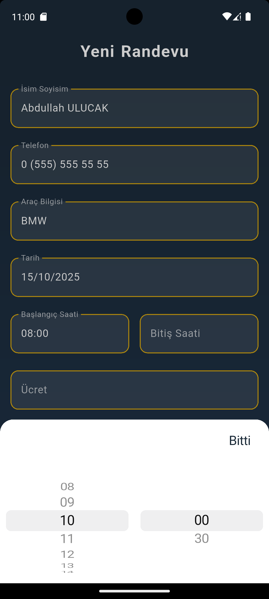
  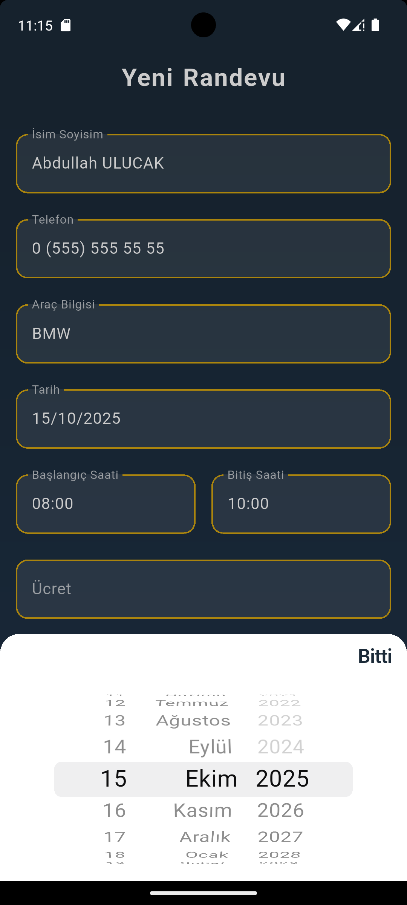

### 📈 İstatistikler Ekranı 💰

  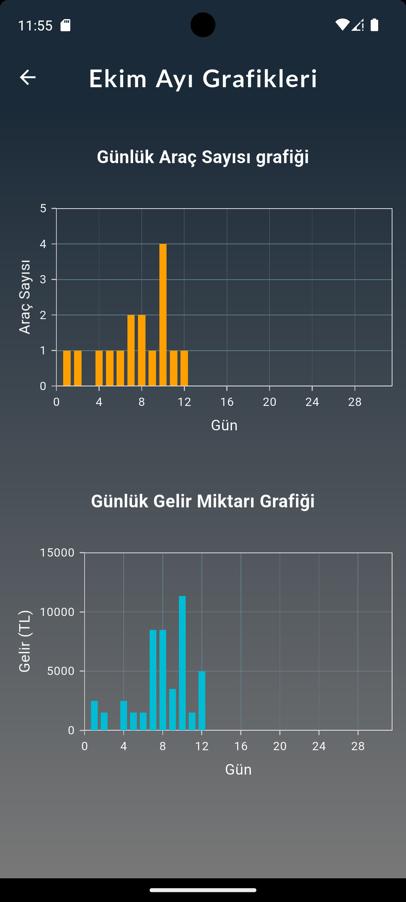
  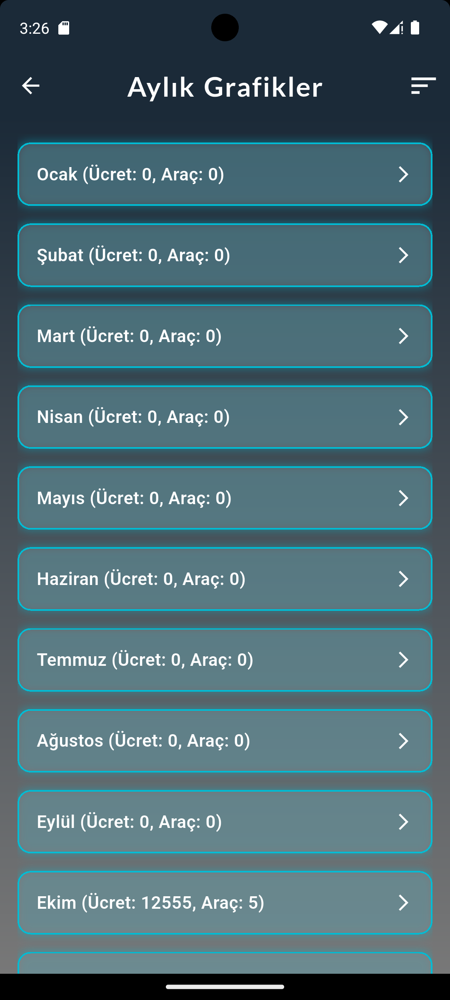
  

### ⚙️ Detay Özellikler ✨

  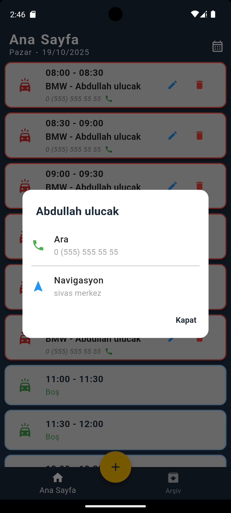
  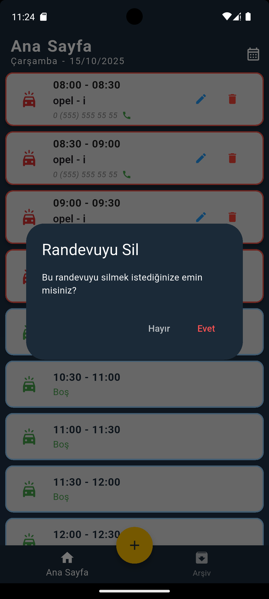
  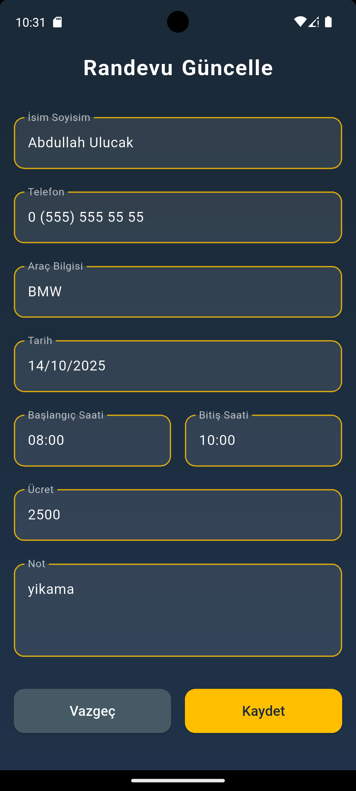

---
